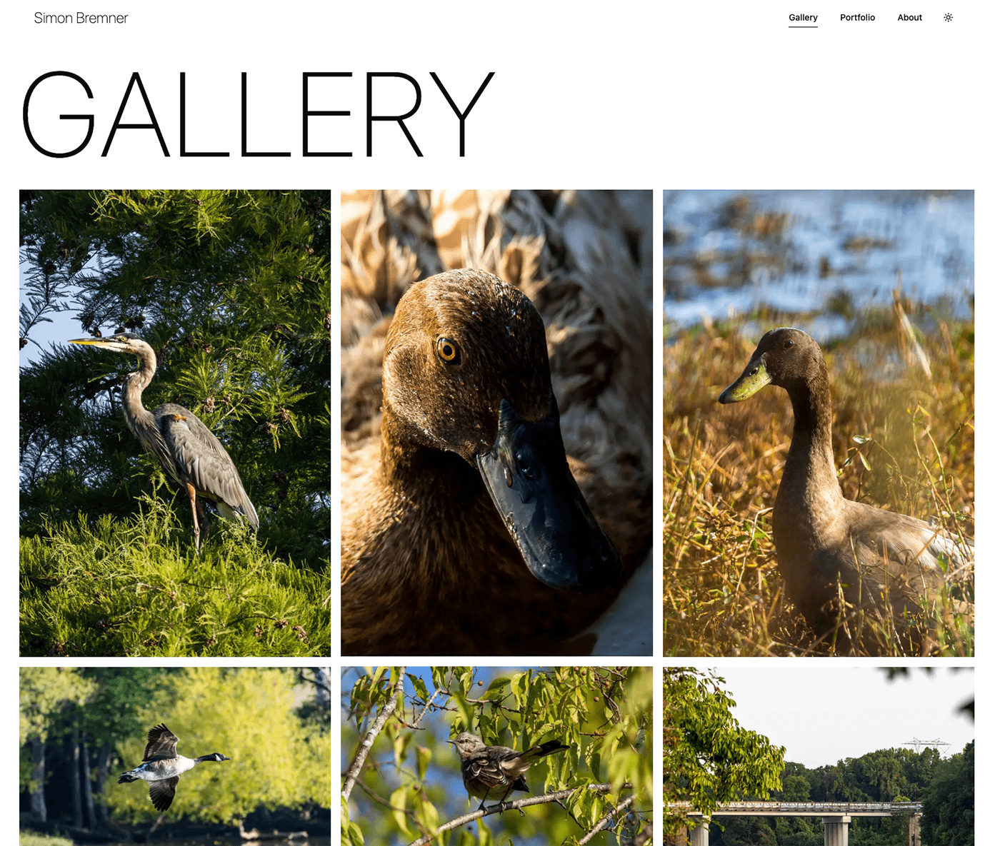

# simonbremner.net

[](https://astro.build/)
[](https://react.dev/)
[](https://www.sanity.io/)
[](https://tailwindcss.com/)
[](LICENSE)

A photography and creative-development portfolio built around considered imagery, responsive interaction, and content managed with Sanity. Astro renders the site on the server, while focused React islands, Motion animations, and custom WebGL effects add interactivity where it matters.

**[Visit simonbremner.net](https://simonbremner.net)**

[](https://simonbremner.net)

## Highlights

- A responsive masonry photography gallery with paginated loading and image metadata.
- Portfolio projects rendered from structured Sanity content and filterable by discipline.
- Responsive Sanity image transformations with WebP and AVIF sources.
- Server-rendered Astro pages enhanced with selectively hydrated React components.
- Motion-powered transitions and scroll-based interactions.
- Custom WebGL image treatments with reduced-motion support.
- Light and dark themes, persistent navigation, and responsive layouts.
- Social, Open Graph, sitemap, and robots metadata for discoverability.

## Technology

| Area                | Tools                                                                                                                        |
| :------------------ | :--------------------------------------------------------------------------------------------------------------------------- |
| Application         | [Astro](https://astro.build/), [React](https://react.dev/), [TypeScript](https://www.typescriptlang.org/)                    |
| Content             | [Sanity](https://www.sanity.io/), GROQ, Portable Text                                                                        |
| Interface           | [Tailwind CSS](https://tailwindcss.com/), [shadcn/ui](https://ui.shadcn.com/), [Radix UI](https://www.radix-ui.com/), Lucide |
| Motion and graphics | [Motion](https://motion.dev/), WebGL                                                                                         |
| Infrastructure      | [SST](https://sst.dev/), AWS                                                                                                 |
| Code quality        | [Biome](https://biomejs.dev/), Astro Check                                                                                   |

## Architecture

This repository is a pnpm workspace containing two connected applications:

- The root application is an Astro SSR site. Astro owns routing and server rendering, with React used for interactive islands such as galleries, navigation, filtering, and image effects.
- [`studio/`](studio/) contains the Sanity Studio used to manage photography, portfolio projects, equipment, software, and social content.

The site queries Sanity with GROQ on the server and builds responsive image URLs through Sanity's image pipeline. An Astro API route supplies additional gallery pages to the client. Production infrastructure is defined with SST and deployed to AWS; the Studio is deployed independently through Sanity.

### Project structure

```text
src/
├── components/       Astro and React UI, content blocks, and WebGL effects
├── layout/           Shared page layout
├── lib/              Sanity queries, image helpers, and utilities
├── pages/            Astro routes and server endpoints
├── styles/           Tailwind theme and global styles
└── types/            Application and generated Sanity types
studio/
├── schemaTypes/      Sanity document and object schemas
└── sanity.config.ts  Studio structure and configuration
```

## Local development

The repository is primarily published as a project showcase. Running it locally requires [Node.js](https://nodejs.org/), [pnpm](https://pnpm.io/), and access to a compatible Sanity project and dataset.

Create a root `.env` file with the Sanity configuration:

```dotenv
PUBLIC_PROJECT_ID="your-project-id"
PUBLIC_DATASET="your-dataset"
```

Install the workspace dependencies and start the site:

```bash
pnpm install
pnpm dev
```

The site is available at `http://localhost:4321`.

Run the Sanity Studio separately when working with schemas or content:

```bash
pnpm --filter studio dev
```

### Commands

| Command                      | Action                               |
| :--------------------------- | :----------------------------------- |
| `pnpm dev`                   | Start the Astro development server   |
| `pnpm build`                 | Create a production build in `dist/` |
| `pnpm preview`               | Preview the production build locally |
| `pnpm check`                 | Run Astro and TypeScript diagnostics |
| `pnpm lint`                  | Run Biome checks                     |
| `pnpm format:write`          | Format the project with Biome        |
| `pnpm --filter studio dev`   | Start Sanity Studio locally          |
| `pnpm --filter studio build` | Build Sanity Studio                  |

## Content and deployment

Sanity schemas live in [`studio/schemaTypes/`](studio/schemaTypes/). Schema changes and Studio deployment are managed from the Studio workspace, separately from the public site.

The Astro application uses server-side rendering and is deployed to AWS with SST. Environment-specific infrastructure, domains, and access controls are configured in [`sst.config.ts`](sst.config.ts).

## License

This project is available under the [MIT License](LICENSE).
